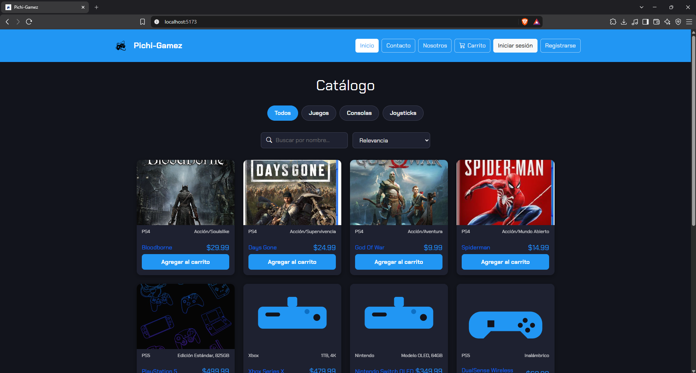
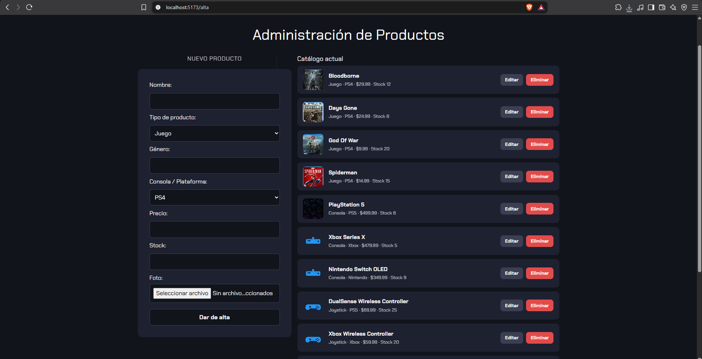
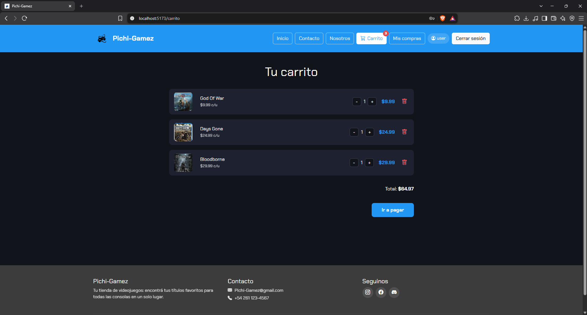

# Pichi-Gamez

Tienda de videojuegos, consolas y accesorios full-stack, con carrito de compras,
checkout, autenticación (local + Google/Facebook) y panel de administración con
alta/baja/modificación de productos.

> **v2 (2026)** — reescritura completa en React + Node/Express de mi proyecto
> original de 2023 ([ver v1, versión estática en Netlify](https://superlative-bunny-bdcb0d.netlify.app/)).
> Lo retomé para aplicar todo lo que aprendí desde entonces: backend real con
> autenticación por JWT, base de datos, control de roles, y una arquitectura
> pensada para escalar en vez de HTML/JS estático sin backend.

**Demo en vivo:** _(agregar acá el link de Netlify/Vercel una vez desplegado)_
**API:** _(agregar acá el link de Render una vez desplegado)_

---

## Índice

- [Qué hace la app](#qué-hace-la-app)
- [Capturas](#capturas)
- [Stack técnico](#stack-técnico)
- [Funcionalidades](#funcionalidades)
- [Usuarios de prueba](#usuarios-de-prueba)
- [Cómo correrlo en local](#cómo-correrlo-en-local)
- [Variables de entorno](#variables-de-entorno)
- [Estructura del proyecto](#estructura-del-proyecto)
- [Qué mejoré respecto a la v1 (2023)](#qué-mejoré-respecto-a-la-v1-2023)
- [Próximos pasos](#próximos-pasos)

---

## Qué hace la app

Pichi-Gamez es una tienda online donde cualquier visitante puede navegar el
catálogo (juegos, consolas y joysticks/accesorios), buscar y ordenar
productos, ver el detalle de cada uno con sus reseñas, y armar un carrito de
compras. Para finalizar la compra hay que loguearse (con usuario propio o con
Google/Facebook) y elegir un método de pago simulado (tarjeta o Mercado
Pago). Los usuarios registrados pueden ver su historial de compras y dejar
reseñas con puntaje de estrellas en los productos.

Además tiene un rol de **administrador**, que puede dar de alta, editar y
eliminar productos del catálogo desde la propia web — con la protección real
del lado del backend (no alcanza con ocultar un botón en el frontend: la API
rechaza esas acciones si el usuario no tiene el rol correcto).

## Capturas

<table>
<tr>
<td align="center"><b>Catálogo</b><br></td>
<td align="center"><b>Administración (ABM)</b><br></td>
<td align="center"><b>Carrito</b><br></td>
</tr>
</table>

## Stack técnico

**Frontend**
- React 18 + Vite
- React Router
- Context API (autenticación y carrito)
- Bootstrap 5 + Bootstrap Icons

**Backend**
- Node.js + Express
- JWT para autenticación sin estado
- Passport.js (OAuth con Google y Facebook)
- bcrypt para hash de contraseñas
- Multer para subida de imágenes
- Base de datos en JSON (pensada para migrar fácil a SQLite/MongoDB)

## Funcionalidades

### Catálogo
- Secciones por categoría: Juegos, Consolas, Joysticks/Accesorios
- Buscador por nombre y orden por precio o alfabético
- Página de detalle por producto, con stock, precio y reseñas
- Sistema de reseñas con puntaje de 1 a 5 estrellas (una por usuario)

### Cuenta de usuario
- Registro y login con usuario/contraseña
- Login social con Google y Facebook (OAuth 2.0)
- Recuperar contraseña por link con token temporal
- Historial de compras ("Mis compras")

### Carrito y checkout
- Carrito persistente (localStorage), no requiere estar logueado para armarlo
- Al pagar, pide login si hace falta y conserva el carrito
- Checkout con selección de método (Tarjeta / Mercado Pago) — simulado,
  preparado para conectar Mercado Pago Checkout Pro real

### Panel de administración
- Alta: cargar nuevos productos (juego, consola o joystick) con imagen
- Modificación: editar cualquier campo de un producto existente
- Baja: eliminar productos del catálogo
- Protegido de punta a punta: el frontend oculta las acciones, pero el
  backend además rechaza la petición si el JWT no tiene rol `admin`

## Usuarios de prueba

| Usuario | Contraseña | Rol |
|---|---|---|
| `admin` | `admin123` | Administrador (ve y usa Alta/Editar/Eliminar) |
| `user` | `user123` | Usuario común (compra, reseña, no ve Alta) |

## Cómo correrlo en local

### 1. Backend

```bash
cd backend
npm install
cp .env.example .env      # en Windows/PowerShell: copy .env.example .env
npm run seed               # crea backend/data/db.json con usuarios y catálogo iniciales
npm run dev                 # http://localhost:4000
```

### 2. Frontend

En otra terminal:

```bash
cd frontend
npm install
cp .env.example .env       # en Windows/PowerShell: copy .env.example .env
npm run dev                 # http://localhost:5173
```

El frontend usa el proxy de Vite para redirigir `/api` y `/uploads` a
`http://localhost:4000`, así que no hay problemas de CORS en desarrollo.

## Variables de entorno

**backend/.env**

| Variable | Para qué sirve |
|---|---|
| `PORT` | Puerto del servidor (default 4000) |
| `JWT_SECRET` | Clave para firmar los tokens de sesión |
| `SESSION_SECRET` | Clave para la sesión temporal que usa Passport en el login social |
| `FRONTEND_URL` | URL del frontend, para CORS y redirects de OAuth |
| `GOOGLE_CLIENT_ID` / `GOOGLE_CLIENT_SECRET` | Credenciales de Google OAuth (opcional) |
| `FACEBOOK_APP_ID` / `FACEBOOK_APP_SECRET` | Credenciales de Facebook OAuth (opcional) |

Si no cargás las credenciales de Google/Facebook, el resto de la app
funciona igual — esos botones simplemente devuelven un aviso en vez de
romper el servidor.

**frontend/.env**

| Variable | Para qué sirve |
|---|---|
| `VITE_API_URL` | URL del backend (ej: `http://localhost:4000/api`) |

## Estructura del proyecto

```
Tienda_videojuegos/
├── backend/
│   ├── app.js                     # app de Express (sin listen, para tests)
│   ├── server.js                  # levanta el servidor
│   ├── config/passport.js         # estrategias OAuth (Google/Facebook)
│   ├── middleware/auth.middleware.js
│   ├── routes/
│   │   ├── auth.routes.js         # login, registro, OAuth, recuperar contraseña
│   │   ├── games.routes.js        # catálogo, alta/baja/modificación, reseñas
│   │   └── orders.routes.js       # carrito → checkout → pago
│   └── utils/{db.js,seed.js}
└── frontend/
    └── src/
        ├── api/api.js
        ├── context/{AuthContext,CartContext}.jsx
        ├── components/{Navbar,Footer,ProtectedRoute,GameCard}.jsx
        └── pages/
            ├── Home.jsx            # catálogo con filtros y búsqueda
            ├── ProductDetail.jsx   # detalle + reseñas
            ├── Login.jsx / Register.jsx
            ├── ForgotPassword.jsx / ResetPassword.jsx
            ├── OAuthCallback.jsx
            ├── Alta.jsx            # alta y edición de productos (admin)
            ├── Cart.jsx / Checkout.jsx / PaymentSuccess.jsx
            └── Orders.jsx          # historial de compras
```

## Qué mejoré respecto a la v1 (2023)

La [primera versión](https://superlative-bunny-bdcb0d.netlify.app/) la hice
en 2023, cuando estaba cursando el bootcamp de Full Stack Engineer en
EducaciónIT, y era un sitio estático en HTML/CSS/JS, con los productos
hardcodeados en el código y un formulario de "alta" que no se conectaba a
ningún lado. Ahora, con más experiencia, la retomé y la volví a hacer de
cero como una aplicación real:

| v1 (2023) | v2 (2026) |
|---|---|
| Productos hardcodeados en JS | Base de datos + API REST |
| Sin backend, sin login | Node/Express + JWT + OAuth |
| Formulario de alta sin funcionalidad | CRUD completo con control de roles |
| Sin forma de comprar | Carrito + checkout + historial de compras |
| Un solo tipo de producto | Categorías (juegos, consolas, joysticks) |
| Sin feedback de usuarios | Sistema de reseñas y rating |

## Próximos pasos

- [ ] Conectar Mercado Pago Checkout Pro real (hoy el pago está simulado)
- [ ] Migrar la base de datos JSON a PostgreSQL/MongoDB para que persista en producción
- [ ] Tests automatizados del backend (Vitest + Supertest)
- [ ] Deploy: backend en Render, frontend en Netlify/Vercel

---

Proyecto hecho por [Adriano Oyola](https://github.com/Oyola3) — estudiante de
la Tecnicatura Superior en Desarrollo de Software (IES 9-023).
